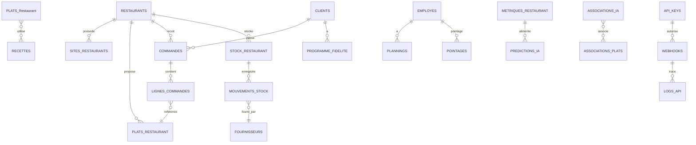

# 00 - ERD GLOBAL

Description: Vue d'ensemble des 12 modules principaux. Relations inter-modules visibles.

Notes:

- Ce diagramme est volontairement synthétique. Pour détails voir les fichiers 01-12.
