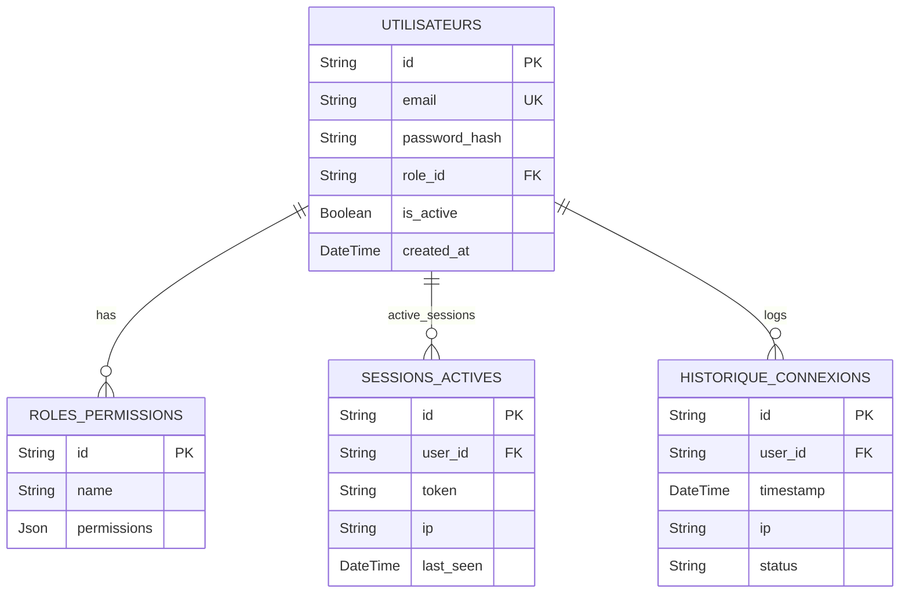

# 01 - ERD Users & Security

## Vue d'ensemble

Gestion des utilisateurs, rôles, sessions et historique connexions.

### Points d'attention

- Index sur `email` (unique).
- TTL pour sessions (via Redis recommended).
