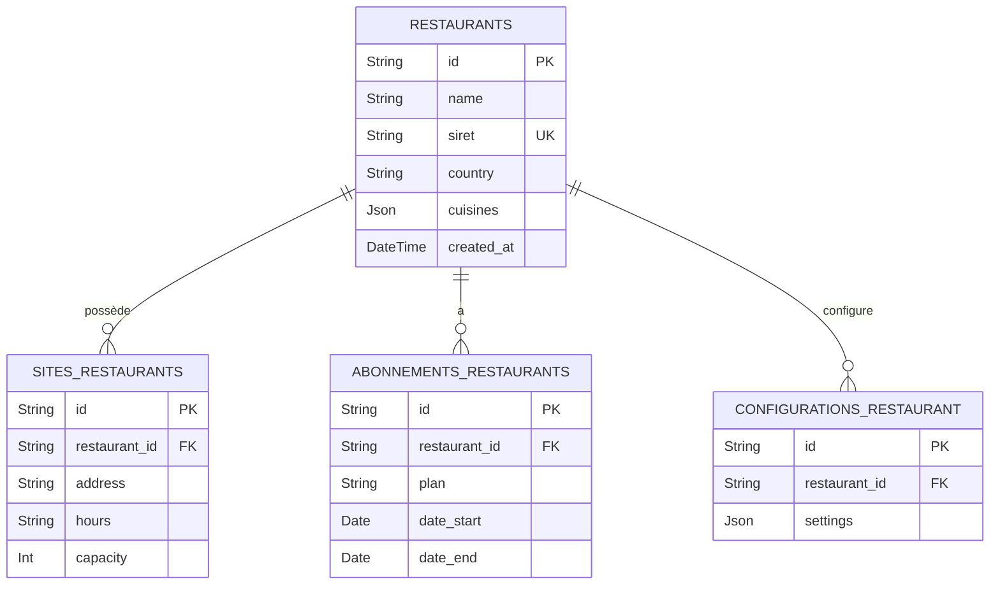

# 02 - ERD Restaurants & Sites

## Vue d'ensemble

Chaines, sites, abonnements et configurations par restaurant.

### Points d'attention

- `cuisines` could be a relation to CUISINES table (denormalized as JSON for quick lookup).
