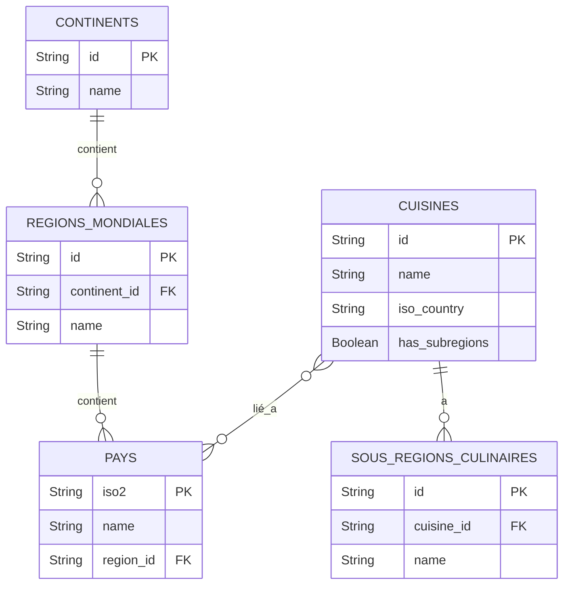

# 03 - ERD Geo & Cuisines

## Vue d'ensemble

Continents, régions, pays et référentiel des cuisines.

```mermaid
erDiagram
    CONTINENTS ||--o{ REGIONS_MONDIALES : contient
    REGIONS_MONDIALES ||--o{ PAYS : contient
    CUISINES ||--o{ SOUS_REGIONS_CULINAIRES : a
    CUISINES }o--o{ PAYS : lié_a

    CONTINENTS {
      String id PK
      String name
    }

    REGIONS_MONDIALES {
      String id PK
      String continent_id FK
      String name
    }

    PAYS {
      String iso2 PK
      String name
      String region_id FK
    }

    CUISINES {
      String id PK
      String name
      String iso_country
      Boolean has_subregions
    }

    SOUS_REGIONS_CULINAIRES {
      String id PK
      String cuisine_id FK
      String name
    }
```

### Points d'attention

- Use ISO codes for joins; index on `iso_country`.
