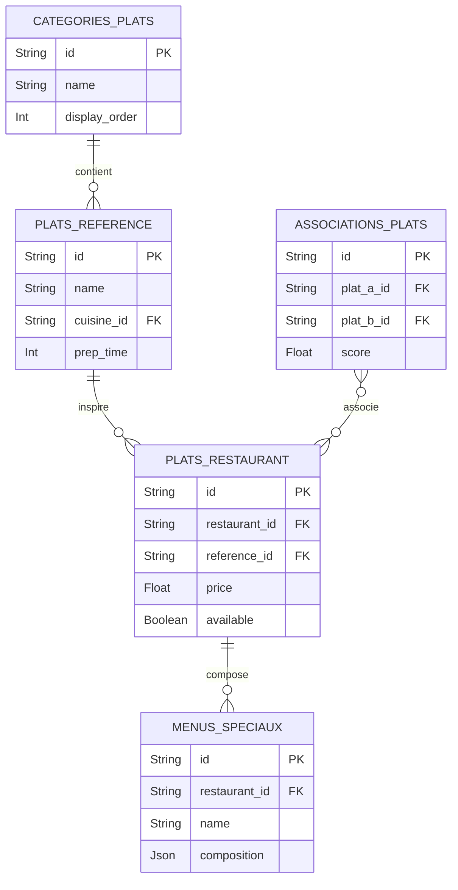

# 04 - ERD Catalogue Plats & Menus

## Vue d'ensemble

Categories, plats de référence, variantes et menus spéciaux.

### Points d'attention

- Partial index on `available` for quick queries of available items.
