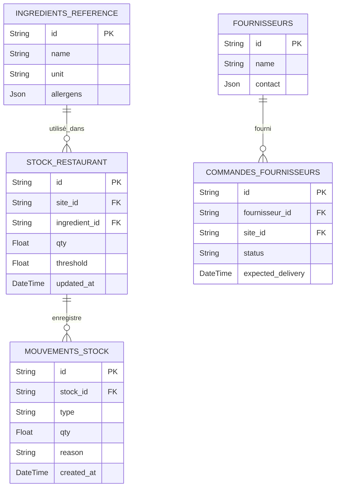

# 05 - ERD Ingredients & Stock

## Vue d'ensemble

Ingrédients de référence, stock par site, mouvements et fournisseurs.

### Points d'attention

- Index composite (site_id, ingredient_id). Partition Mouvements_Stock by year for scale.
