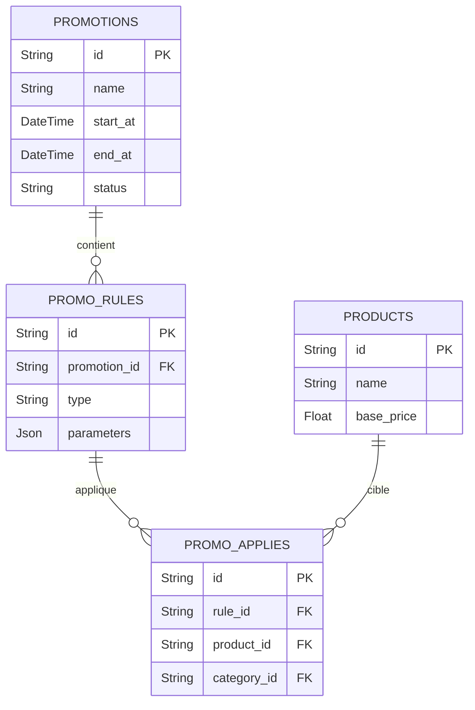

# 06 - ERD Promotions & Pricing

## Vue d'ensemble

Promotions, règles de prix, historiques et application par produit / catégorie.

### Points d'attention

- Évaluer la priorité d'exécution (stackable promotions). Tester conflit de règles.
