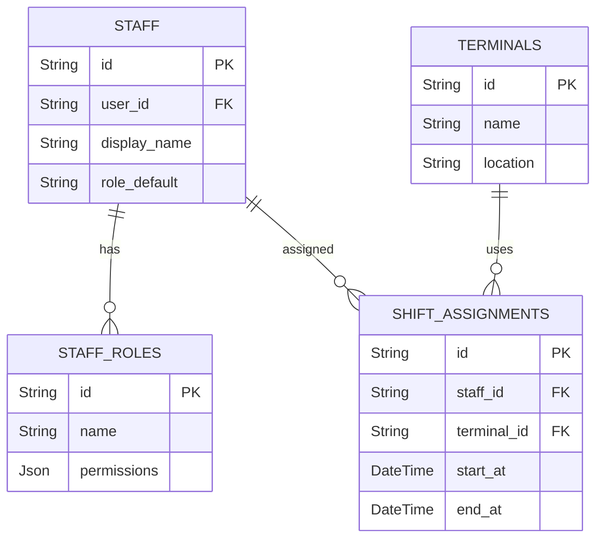

# 07 - ERD Staff & Roles

## Vue d'ensemble

Utilisateurs internes (serveurs, cuisiniers, managers), rôles et accès aux terminaux.

### Points d'attention

- Permissions stockées en JSON -> mapper à un modèle RBAC si complexité augmente.
