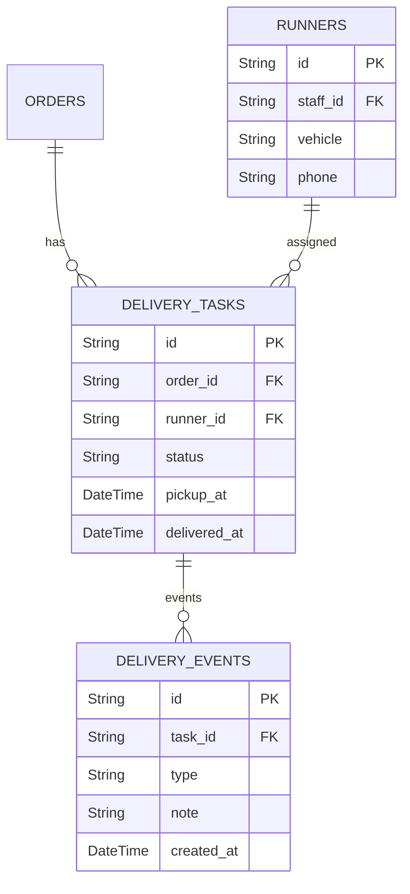

# 08 - ERD Delivery & Runner

## Vue d'ensemble

Gestion des livraisons, coureurs (runners) et statuts de livraison.

### Points d'attention

- Suivi temps réel: prévoir websocket/redis pour l'état des tâches.
