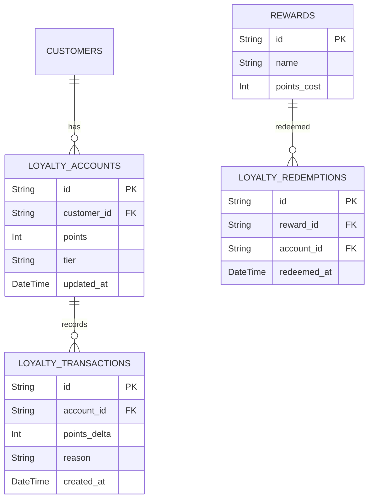

# 09 - ERD Loyalty & Customers

## Vue d'ensemble

Programme de fidélité, points, niveaux et récompenses.

### Points d'attention

- Consistance forte sur les points: transactions atomiques ou CQRS.
