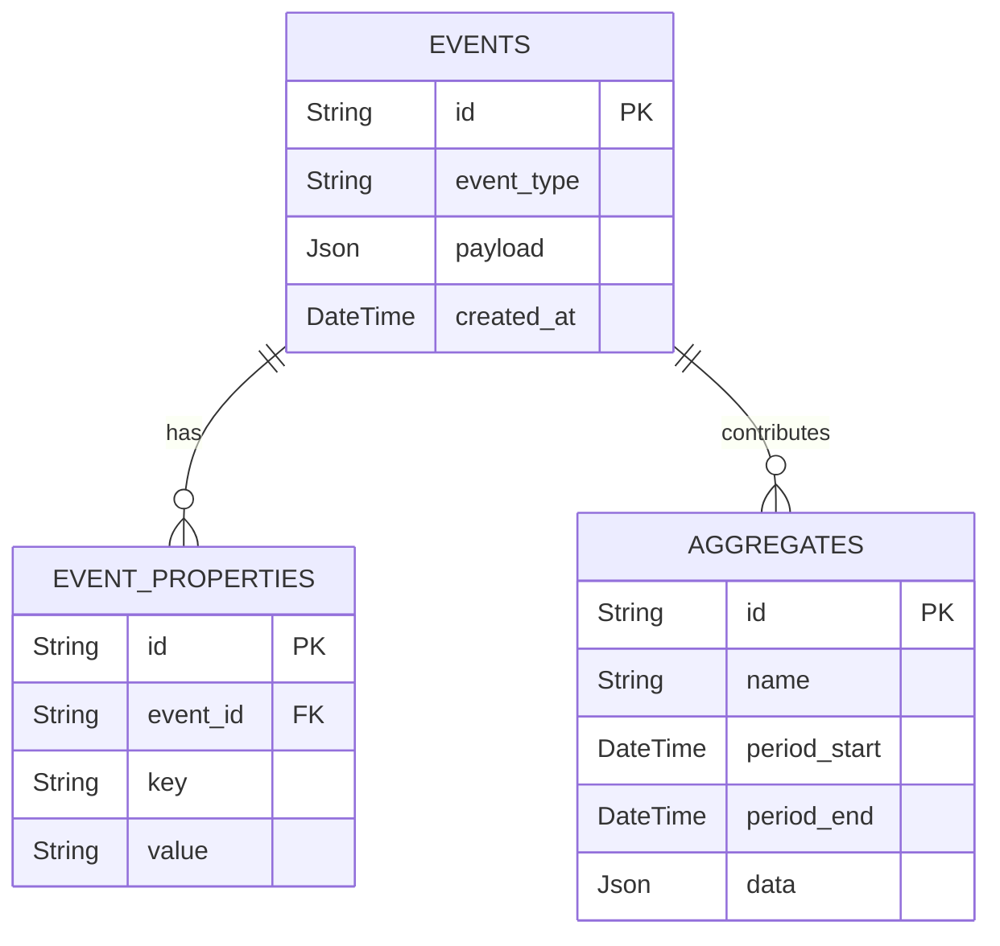

# 10 - ERD Analytics & Events

## Vue d'ensemble

Événements et tables agrégées pour rapports/BI.

### Points d'attention

- Garder retention policy pour EVENTS et indexer par event_type + created_at.
