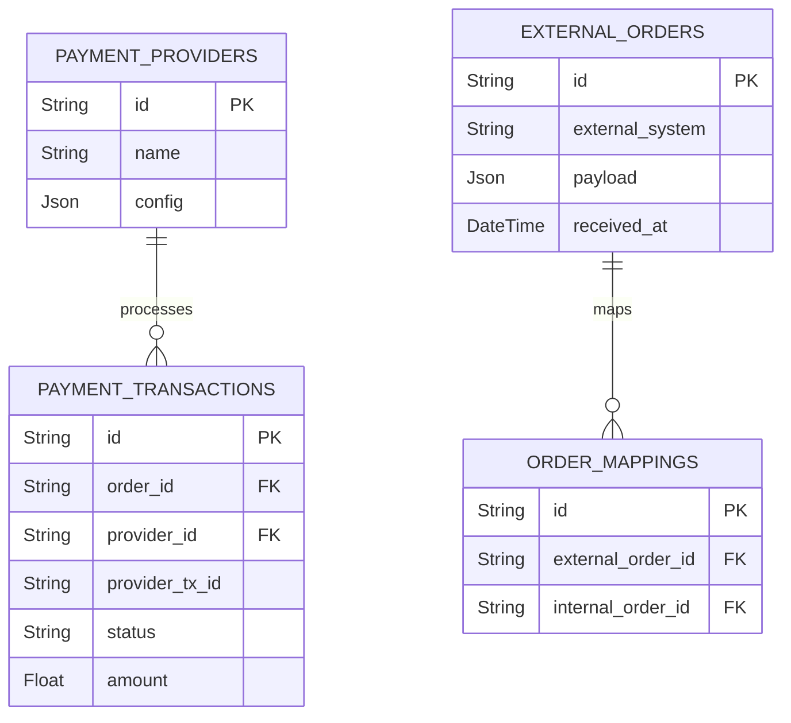

# 11 - ERD External Integrations

## Vue d'ensemble

Intégrations externes (paiement, compta, tickets) et mappings vers entités internes.

### Points d'attention

- Garder logs immuables pour réconciliation comptable.
