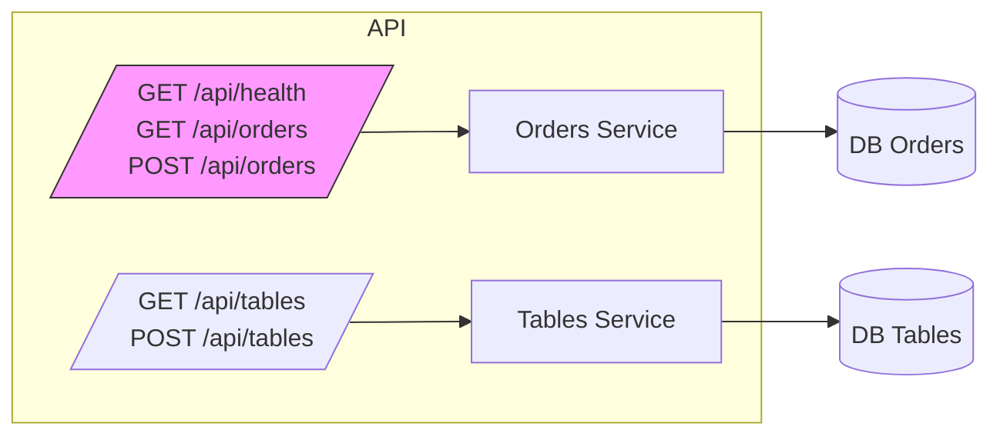

# 12 - ERD API / Routes Mapping

## Vue d'ensemble

Mapping des routes API critiques et ressources exposées.

### Points d'attention

- Securiser endpoints critiques et ajouter rate limiting pour webhooks publics.
